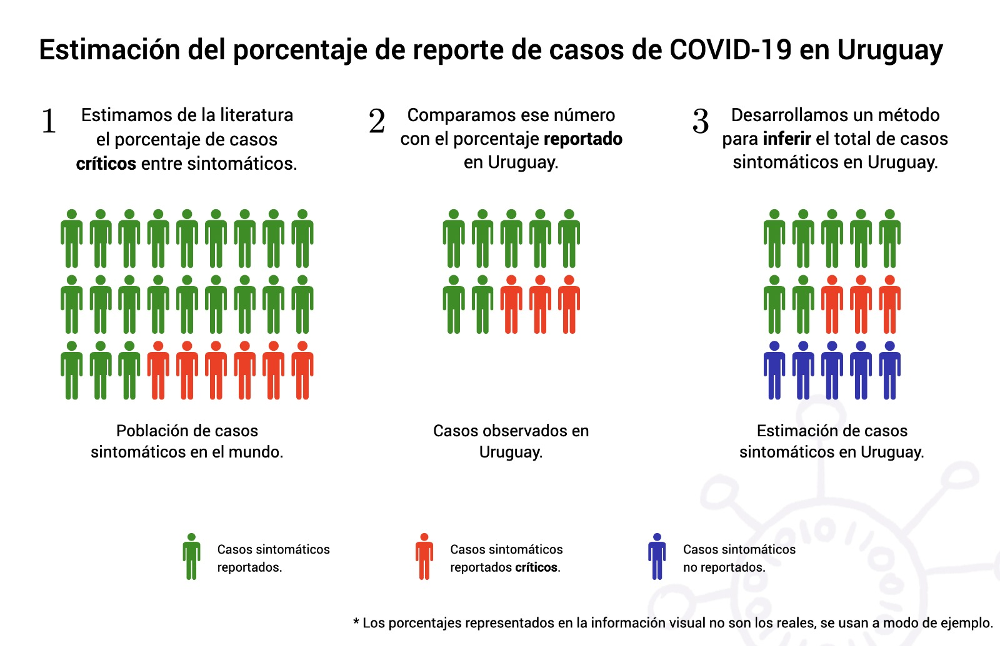

Uno de los principales problemas en el manejo del coronavirus en gran parte de los países afectados es que se desconoce la cantidad real de personas infectadas. Esto se debe a varias causas, principalmente la falta de capacidad de testeo y la considerable cantidad de casos sin síntomas o con síntomas leves (aunque todavía se desconoce qué proporción de infecciones de coronavirus son asintomáticas o leves). Este es un problema crítico, porque las políticas de salud pública dependerán en gran medida de la prevalencia del virus en la población. 

Pero aunque es difícil conocer la cifra exacta de casos en un país, diferentes métodos de análisis permiten hacer estimaciones sobre qué porcentaje de los casos reales son reportados. En el tercer informe técnico publicado por el grupo GUIAD-COVID-19 de académicos Uruguayos  (que puede descargarse desde la sección Reportes Técnicos), adaptamos uno de estos métodos para estimar qué porcentaje de casos sintomáticos en Uruguay es detectado. El método se basa, de cierta forma, en estimar cuantos casos críticos se esperaría observar a partir de la cantidad de casos reportados en el país. Luego este número se compara con la cantidad de casos críticos que se declararon en el país. Si los casos **críticos observados** en el país son más que los **críticos esperados**, esto sugiere la presencia de casos de COVID-19 que no fueron detectados. El método permite luego estimar qué porcentaje de los casos sintomáticos reales fue efectivamente detectado. Un punto fuerte del método es que se basa en los casos críticos reportados, que por la intensa atención médica que reciben, se espera que estén mucho mejor detectados que los casos no críticos. Un punto débil importante es que no estima directamente el porcentaje de reporte hoy, sino que sólo puede estimar el porcentaje de reporte aproximadamente 10 días en el pasado.

Utilizando este método con los datos disponibles públicamente hasta el día 16 de Abril, y asumiendo que todos los casos reportados presentaban síntomas, estimamos que hasta hace aproximadamente 10 días un 63% de los casos sintomáticos en Uruguay eran detectados. Como cualquier método de estimación estadístico, hay un rango de error alrededor del estimado, y aunque 63% es el valor más probable según nuestro análisis, el rango de valores confiables se encuentra entre 45% y 91%. **Esto significa que hace aproximadamente 10 días (el 10 de Abril), por cada 100 sintomáticos reportados habían 54 sintomáticos no reportados (con un rango de confianza entre 4 y 120 no reportados, aunque tomando en cuenta toda la incertidumbre del análisis el rango puede ser aún mayor)**. Notemos que esto refiere sólo a los casos sintomáticos, y que la cantidad de casos totales será aún mayor (pues existen muchos casos asintomáticos), aunque las incertidumbres respecto al coronavirus hacen que no sea fácil estimar esta cifra.

Para finalizar, es importante señalar algunas limitantes y formas de mejorar estos estimados. Por un lado, este método hace varias suposiciones sobre el reporte de casos en Uruguay, y sobre diferentes parámetros epidemiológicos. El método es tan bueno como lo sean estas suposiciones, y por lo tanto sus resultados no son definitivos, y tienen que compararse con otros métodos complementarios. Por otro lado, con mayor información sobre el estado de la epidemia y los casos reportados en Uruguay sería posible mejorar y extender este resultado (por ejemplo, hacerlo más exacto, o estimar el porcentaje de casos reportados por franaja etaria). Aunque los datos disponibles públicamente son suficientes para la mayoría de la población general, los análisis detallados del estado de la epidemia en el país, así como la posibilidad de hacer proyecciones de como progresará la misma, requieren el acceso a información más detallada que la que está disponible públicamente.