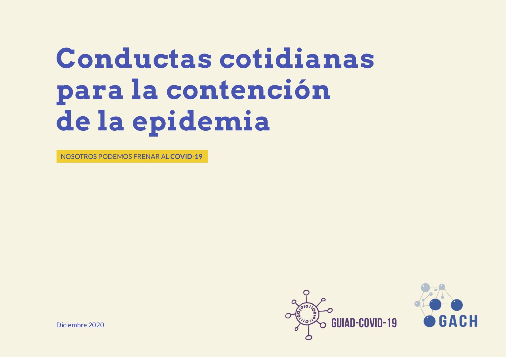
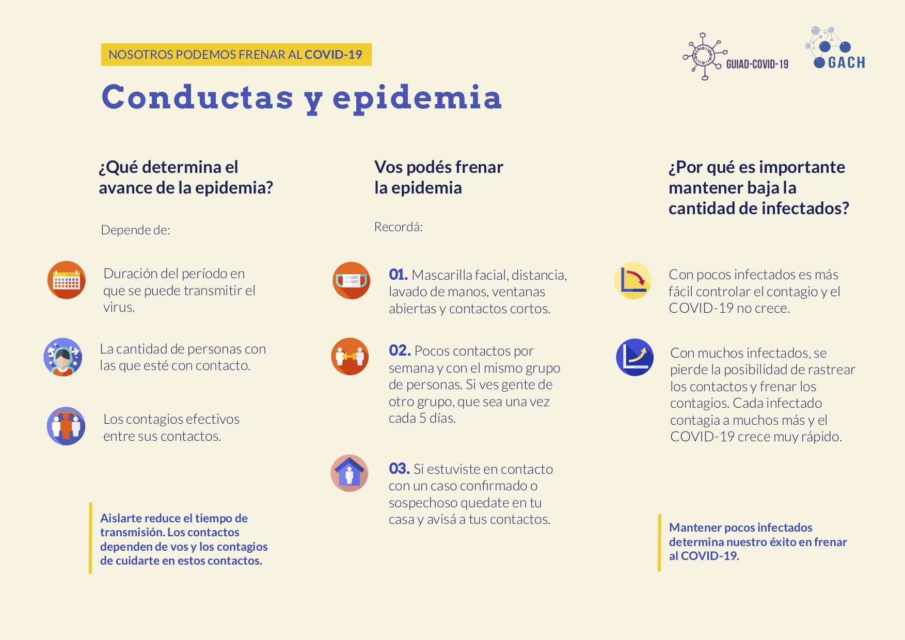
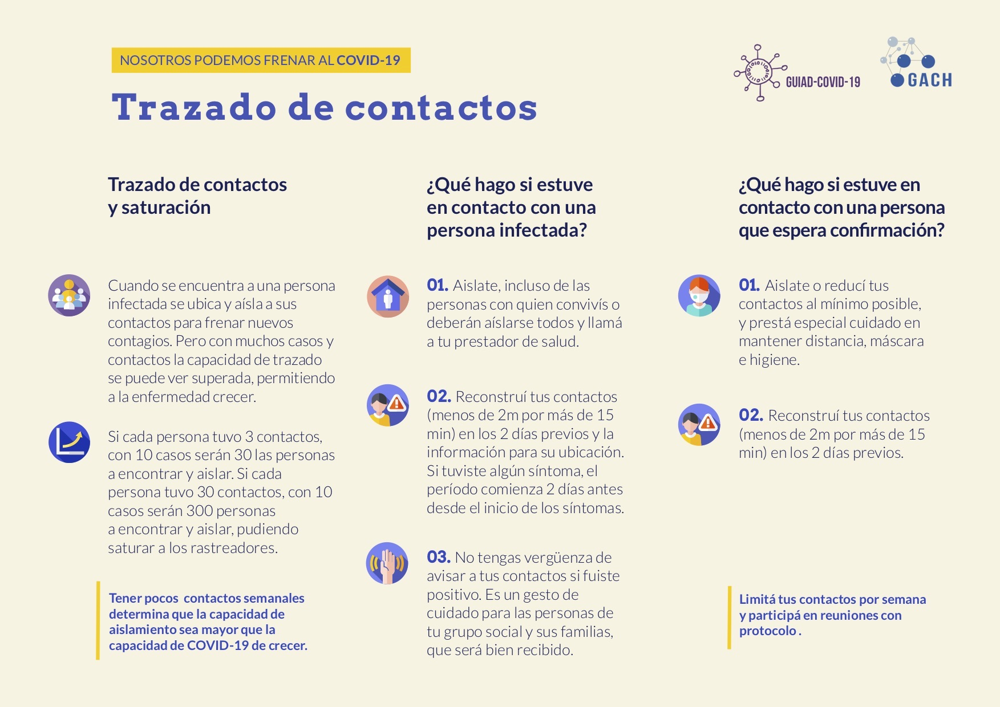
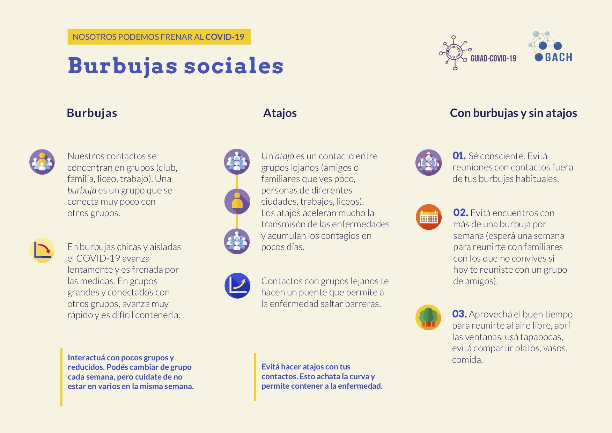
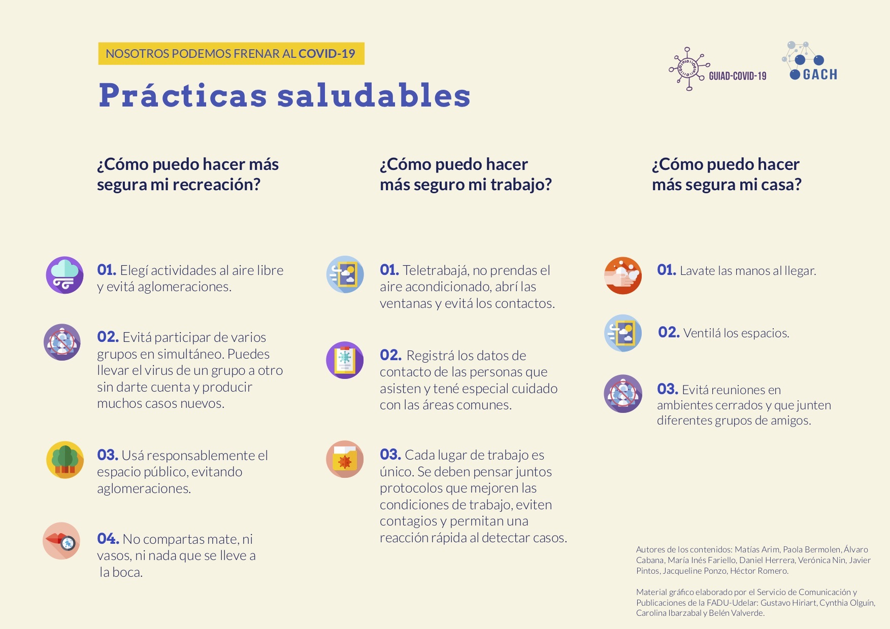

Está disponible para descargar una serie de recomendaciones y buenas prácticas para contener la expansión del virus, elaboradas por miembros de GUIAD-COVID-19 y el GACH, y con diseño del Servicio de Comunicación y Publicaciones de la FADU-Udelar. Puede descargarse en formato PDF desde [Reportes técnicos](/#publications).

